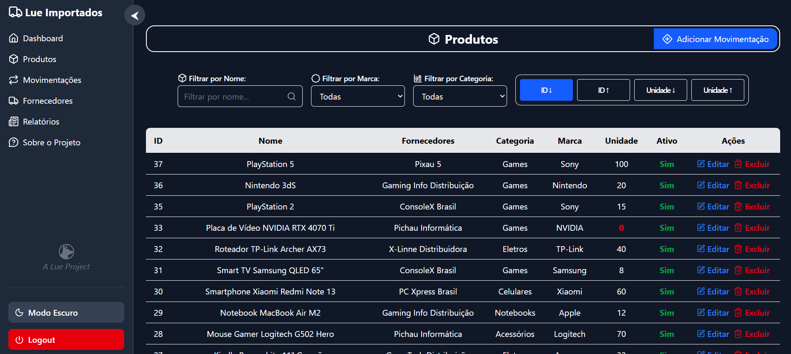
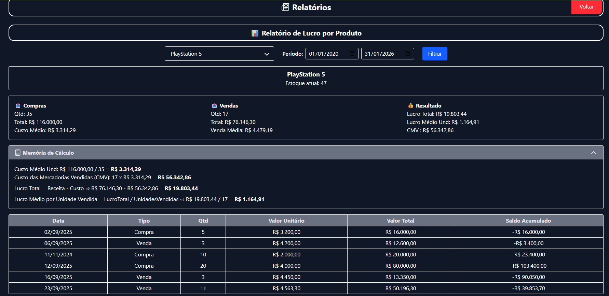
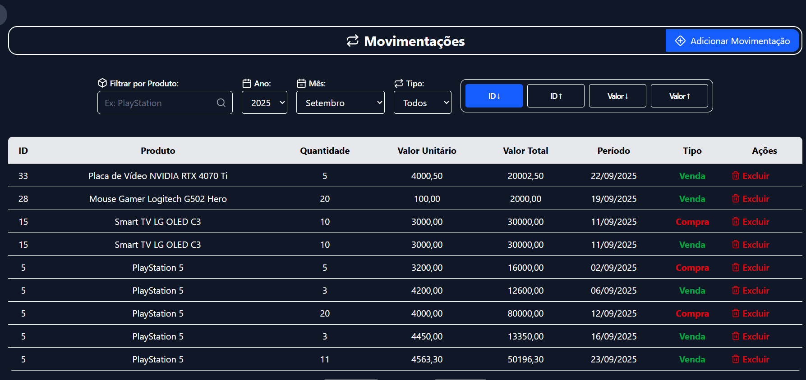
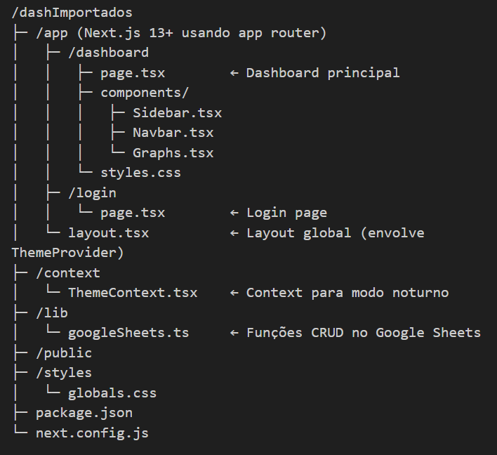

> [!TIP] LINK DA APLICAÇÂO
> [Conteúdo aqui](https://07-dash-importados.vercel.app/login)

## DASHBOARD FULLSTACK

projeto nextReack > API REST < GOOGLESHEET(banco de dados)

-Dashboard com  6 painneis para analise
-Cadastre novos produtos
-Cadastre Fornecedores
-Faça movimentações de compra e venda
-Gere diversos relatorios gerenciais,analiticos com memoria de calculo, financeiro, etc com geraração em PDF

## ESTRUTURA DO PROJETO

